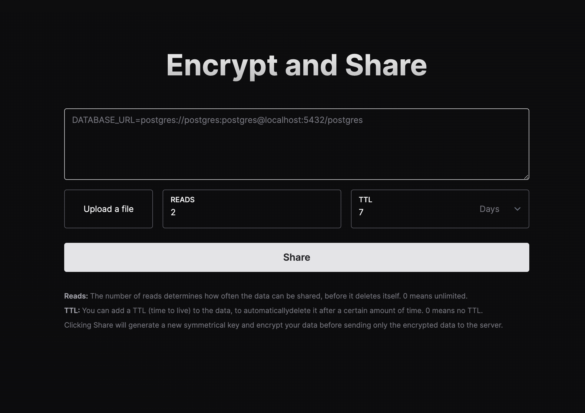

<div align="center">
    <h1 align="center">EnvShare</h1>
    <h5>Share Environment Variables Securely</h5>
</div>

<div align="center">
  <a href="https://envshare.dev">envshare.dev</a>
</div>
<br/>

EnvShare is a simple tool to share environment variables securely. It uses
**AES-GCM** to encrypt your data before sending it to the server. The encryption
key never leaves your browser.

## Features

- **Shareable Links:** Share your environment variables securely by sending a
  link
- **End-to-End Encryption:** AES-GCM encryption is used to encrypt your data
  before sending it to the server
- **Limit number of reads:** Limit the number of times a link can be read
- **Auto Expire:** Automatically expire links and delete data after a certain
  time

<br/>



## Built with

- [Next.js](https://nextjs.org)
- [tailwindcss](https://tailwindcss.com)
- Deployed on [Vercel](https://vercel.com?utm_source=envshare)
- Data stored on [Upstash](https://upstash.com?utm_source=envshare)

## Deploy your own

Detailed instructions can be found [here](https://envshare.dev/deploy)

All you need is a Redis database on Upstash and a Vercel account. Click the
button below to clone and deploy:

[](https://vercel.com/new/clone?demo-title=EnvShare&demo-description=Simple%20Next.js%20%2B%20Upstash%20app%20to%20share%20environment%20variables%20securely%20using%20AES-GCM%20encryption.&demo-url=https%3A%2F%2Fenvshare.dev%2F&demo-image=%2F%2Fimages.ctfassets.net%2Fe5382hct74si%2F5SaFBHXp5FBFJbsTzVqIJ3%2Ff0f8382369b7642fd8103debb9025c11%2Fenvshare.png&project-name=EnvShare&repository-name=envshare&repository-url=https%3A%2F%2Fgithub.com%2Fchronark%2Fenvshare&from=templates&integration-ids=oac_V3R1GIpkoJorr6fqyiwdhl17)


## Sponsors

<table>
<tr>
<td>
  
  <a href="https://upstash.com/?utm_source=envshare" >
  
  </a>
<h3>Upstash: Serverless Database for Redis</h3>

<ul>
    <li>Serverless Redis with global replication and durable storage</li>
    <li>Price scales to zero with per request pricing</li>
    <li>Built-in REST API designed for serverless and edge functions</li>
  </ul>

[Start for free in 30 seconds!](https://upstash.com/?utm_source=envshare)

</td>
</tr>
</table>

## Configuration

### Environment Variables

`ENABLE_VERCEL_ANALYTICS` Any truthy value will enable Vercel Analytics. This is turned off by default

## Contributing

This repository uses `pnpm` to manage dependencies. Install it using
`npm install -g pnpm`

Please run `pnpm fmt` before committing to format the code.

## Docs

Docs in the README are temporary and will be moved to the website soon.

### API

#### Store a secret

**PLEASE NEVER EVER UPLOAD UNENCRYPTED SECRETS.**

This endpoint is only meant to store **already encrypted** secrets. The
encrypted secrets are stored in plain text.

```sh-session
$ curl -XPOST -s https://envshare.dev/api/v1/secret -d "already-encrypted-secret"
```

You can add optional headers to configure the ttl and number of reads.

```sh-session
$ curl -XPOST -s https://envshare.dev/api/v1/secret -d "already-encrypted-secret" -H "envshare-ttl: 3600" -H "envshare-reads: 10"
```

- Omitting the `envshare-ttl` header will set a default of 30 days. Disable the
  ttl by setting it to 0. (`envshare-ttl: 0`)
- Omitting the `envshare-reads` header will simply disable it and allow reading
  for an unlimited number of times.

This endpoint returns a JSON response with the secret id:

```json
{
  "data": {
    "id": "HdPbXgpvUvNk43oxSdK97u",
    "ttl": 86400,
    "reads": 2,
    "expiresAt": "2023-01-19T20:47:28.383Z",
    "url": "http://envshare.dev/api/v1/secret/HdPbXgpvUvNk43oxSdK97u"
  }
}
```

#### Retrieve a secret

You need an id to retrieve a secret. The id is returned when you store a secret.

```sh-session
$ curl -s https://envshare.dev/api/v1/secret/HdPbXgpvUvNk43oxSdK97u
```

```json
{
  "data": {
    "secret": "Hello",
    "remainingReads": 1
  }
}
```
